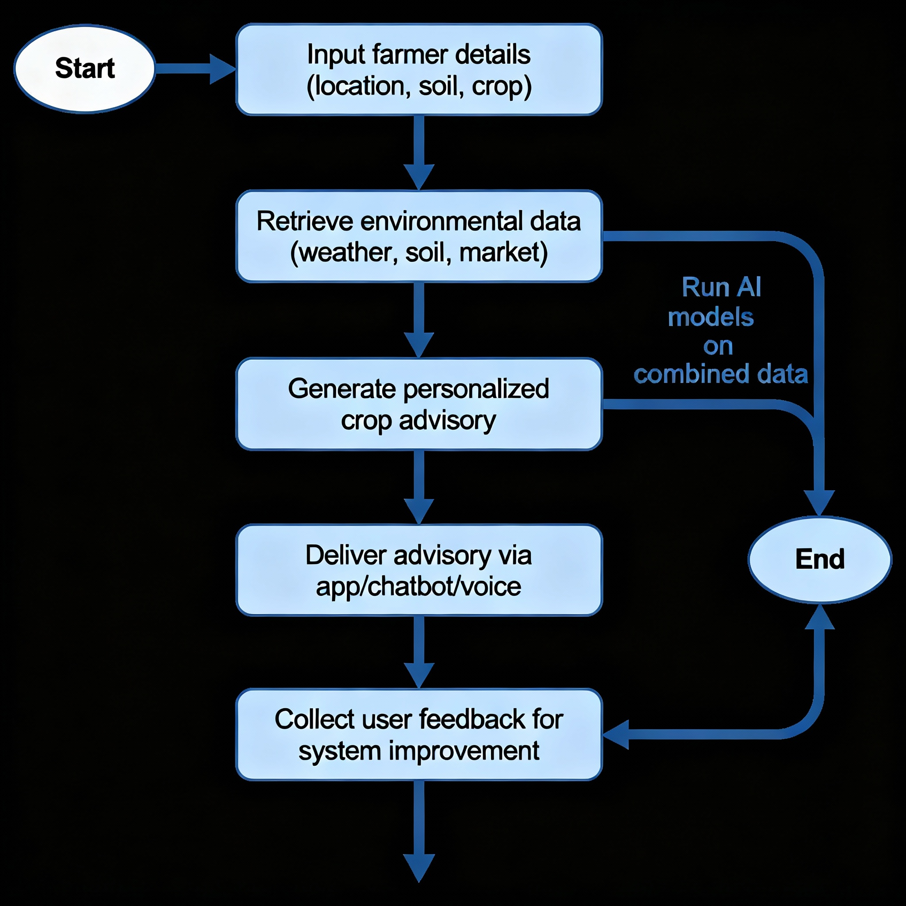

# Smart India Hackathon Workshop
# Date:26/09/25
## Register Number:25010247
## Name:U.Deepika
## Problem Title
SIH 25010: Smart Crop Advisory System for Small and Marginal Farmers
## Problem Description
A majority of small and marginal farmers in India rely on traditional knowledge, local shopkeepers, or guesswork for crop selection, pest control, and fertilizer use. They lack access to personalized, real-time advisory services that account for soil type, weather conditions, and crop history. This often leads to poor yield, excessive input costs, and environmental degradation due to overuse of chemicals. Language barriers, low digital literacy, and absence of localized tools further limit their access to modern agri-tech resources.

Impact / Why this problem needs to be solved

Helping small farmers make informed decisions can significantly increase productivity, reduce costs, and improve livelihoods. It also contributes to sustainable farming practices, food security, and environmental conservation. A smart advisory solution can empower farmers with scientific insights in their native language and reduce dependency on unreliable third-party advice.

Expected Outcomes

• A multilingual, AI-based mobile app or chatbot that provides real-time, location-specific crop advisory.
• Soil health recommendations and fertilizer guidance.
• Weather-based alerts and predictive insights.
• Pest/disease detection via image uploads.
• Market price tracking.
• Voice support for low-literate users.
• Feedback and usage data collection for continuous improvement.

Relevant Stakeholders / Beneficiaries

• Small and marginal farmers
• Agricultural extension officers
• Government agriculture departments
• NGOs and cooperatives
• Agri-tech startups

Supporting Data

• 86% of Indian farmers are small or marginal (NABARD Report, 2022).
• Studies show ICT-based advisories can increase crop yield by 20–30%.

## Problem Creater's Organization
Government of Punjab

## Theme
Agriculture, FoodTech & Rural Development

## Proposed Solution
<ul>
  <li>
    <strong>Multilingual, AI-powered mobile app and chatbot:</strong> Provides personalized and location-specific crop advisory tailored to soil, weather, and crop history.
  </li>
  <li>
    <strong>Personalized crop, fertilizer, and pest management advice:</strong> Uses machine learning to recommend optimal crop choices, fertilization schedules, and pest control methods based on real-time data.
  </li>
  <li>
    <strong>Real-time weather alerts and market price updates:</strong> Keeps farmers informed about upcoming weather changes and current crop prices to support better decision-making.
  </li>
  <li>
    <strong>Image-based pest and disease detection:</strong> Allows farmers to upload photos of crops to identify pests or diseases accurately using AI-driven image recognition.
  </li>
  <li>
    <strong>Voice support for low-literacy users:</strong> Enables farmers with limited reading skills to interact with the system using voice commands and receive advice in their native language.
  </li>
  <li>
    <strong>Continuous feedback collection and system improvement:</strong> Gathers user feedback and usage data to enhance advisory accuracy and relevance over time.
  </li>
  <li>
    <strong>Integration with government schemes and subsidies:</strong> Facilitates access to relevant agricultural subsidies and government programs directly through the app.
  </li>
  <li>
    <strong>Environmental sustainability focus:</strong> Optimizes fertilizer and water usage to reduce costs and minimize environmental impact.
  </li>
</ul>

## Technical Approach
<h2>Technologies to be Used</h2>
<ul>
  <li><strong>Programming Languages:</strong> Python, JavaScript</li>
  <li><strong>Frameworks:</strong> TensorFlow, PyTorch (AI/ML), React Native or Flutter (mobile app)</li>
  <li><strong>APIs:</strong> Weather APIs, Soil data APIs, Satellite imagery APIs</li>
  <li><strong>Hardware:</strong> Smartphones, Cloud servers, IoT sensors</li>
  <li><strong>Databases:</strong> SQL/NoSQL for farmer and crop data</li>
  <li><strong>Additional Tech:</strong> Image recognition for pest detection, NLP for voice and multilingual support</li>
</ul>

<h2>Methodology and Process for Implementation</h2>
<ol>
  <li>User Inputs: Location, soil type, crop info, images of pests or crops.</li>
  <li>Data Collection: Weather, soil health, historical crop data, and market prices.</li>
  <li>AI Processing: Machine learning models analyze the combined data.</li>
  <li>Advisory Generation: Personalized recommendations on crops, fertilizer, pest control, weather alerts, and market trends.</li>
  <li>User Interaction: Deliver recommendations via chatbot, mobile app, or voice in local languages.</li>
  <li>Feedback Loop: Collect user feedback for retraining and improving AI models.</li>
  <li>Continuous Updates: Update recommendations based on new data like weather changes and pest outbreaks.</li>
</ol>

## Feasibility and Viability
<h2>Feasibility Analysis</h2>

The idea is feasible with current technology, given the widespread use of smartphones, advances in AI and machine learning, and availability of satellite and weather data. The Indian government's focus on digital agriculture and rural empowerment further supports viability. However, integration of varied data sources, language diversity, and ensuring user-friendly interfaces remain critical success factors. Pilot projects and partnerships with local agricultural bodies can enhance adoption and scalability.

<h2>Potential Challenges and Risks</h2>
<ul>
  <li><strong>Digital Literacy:</strong> Many small and marginal farmers have limited experience with smartphones and apps, which could hamper adoption.</li>
  <li><strong>Language Barriers:</strong> India’s linguistic diversity necessitates multilingual support, complicating development.</li>
  <li><strong>Data Accuracy:</strong> Inaccurate or incomplete soil, weather, or pest data can lead to wrong recommendations.</li>
  <li><strong>Connectivity Issues:</strong> Rural areas may have poor internet connectivity, limiting real-time data delivery.</li>
  <li><strong>Trust and Adoption:</strong> Farmers may hesitate to trust AI-based advices, preferring traditional methods.</li>
  <li><strong>Maintenance and Updates:</strong> Regular updates and bug fixes are needed to keep the app reliable and relevant.</li>
  <li><strong>Cost:</strong> Development, deployment, and maintenance costs could be high without sustainable funding.</li>
</ul>

<h2>Strategies to Overcome Challenges</h2>
<ul>
  <li><strong>User Education:</strong> Conduct training sessions and awareness programs to improve digital literacy among farmers.</li>
  <li><strong>Voice and Visual Interfaces:</strong> Use voice commands and images to overcome language and literacy issues.</li>
  <li><strong>Localized Data Source Integration:</strong> Collaborate with local agricultural offices to ensure accurate data inputs.</li>
  <li><strong>Offline Functionality:</strong> Incorporate offline features and SMS-based alerts for regions with low connectivity.</li>
  <li><strong>Pilot Programs:</strong> Implement pilot deployments with farmer feedback loops to build trust and improve the system.</li>
  <li><strong>Partnerships:</strong> Work with government, NGOs, and agri-tech startups for support, funding, and outreach.</li>
  <li><strong>Continuous Improvement:</strong> Use user feedback to refine algorithms and interfaces continuously.</li>
</ul>

## Impact and Benefits
<h2>Potential Impact on the Target Audience</h2>

The AI-powered smart crop advisory system can significantly empower small and marginal farmers by providing personalized, data-driven insights that improve decision-making. Farmers gain access to accurate crop recommendations, pest and disease detection, and timely weather alerts that help reduce risks and increase agricultural productivity. This leads to better crop yield, optimized resource usage, and decreased crop failure risks. The system connects farmers with market price trends and government schemes, enhancing their economic opportunities and access to subsidies.

<h2>Benefits of the Solution</h2>
<h3>Social Benefits</h3>
<ul>
  <li>Improves livelihoods by increasing farmers' income through higher yields and reduced input costs.</li>
  <li>Enhances food security by promoting sustainable farming practices that increase crop reliability.</li>
  <li>Promotes digital inclusion by offering multilingual and voice-based interfaces suitable for low-literacy users.</li>
  <li>Facilitates knowledge sharing and community empowerment.</li>
</ul>

<h3>Economic Benefits</h3>
<ul>
  <li>Reduces costs of fertilizers, pesticides, and water through precision recommendations.</li>
  <li>Improves market access and fair pricing via real-time market trend updates.</li>
  <li>Supports government subsidy programs to financially assist farmers.</li>
  <li>Drives rural economic growth by enhancing the efficiency and profitability of farming.</li>
</ul>

<h3>Environmental Benefits</h3>
<ul>
  <li>Encourages sustainable use of inputs, reducing chemical overuse and soil degradation.</li>
  <li>Supports conservation of water resources through optimized irrigation advisories.</li>
  <li>Promotes biodiversity by recommending eco-friendly pest control methods.</li>
  <li>Reduces carbon footprint by improving overall farm efficiency.</li>
</ul>

## Research and References
<h2>References and Research Work</h2>
<ul>
  <li>
    <strong>Artificial Intelligence in Agriculture: Advancing Crop Productivity and Sustainability</strong> 
    Source: ScienceDirect 
    <a href="https://www.sciencedirect.com/science/article/pii/S2666154325001334" target="_blank">Read more</a> 
    Discusses the role of AI in improving crop yields, pest management, and sustainable farming practices.
  </li>
  <li>
    <strong>AI in Agriculture — The Future of Farming</strong> 
    Source: Intellias 
    <a href="https://intellias.com/artificial-intelligence-in-agriculture/" target="_blank">Read more</a> 
    Overview of AI applications in agriculture, including advisory systems, precision farming, and data analytics.
  </li>
  <li>
    <strong>Harnessing Artificial Intelligence for Agricultural Advisory Services</strong> 
    Source: Journal of Agricultural Research and Innovation 
    <a href="https://journalacri.com/index.php/ACRI/article/download/1443/3515/2016" target="_blank">Read more</a> 
    Insights on AI models and methodologies used for personalized crop recommendations and pest detection.
  </li>
  <li>
    <strong>AI-Powered Crop Advisory Platform & Farm Advisory System</strong> 
    Source: Farmonaut 
    <a href="https://farmonaut.com/precision-farming/ai-powered-farm-advisory-boost-yields-with-farmonaut" target="_blank">Read more</a> 
    Case study on an AI-based advisory platform enhancing farm output through satellite and sensor data integration.
  </li>
  <li>
    <strong>Sustainable Agriculture: Definition, Principles, and Benefits</strong> 
    Source: Fonds de Dotation Roullier 
    <a href="https://www.fondsdedotationroullier.org/en/the-endowment-fund/sustainable-agriculture-definition-principles-and-benefits/" target="_blank">Read more</a> 
    Explains environmental and social benefits of sustainable farming enhanced by technology adoption.
  </li>
  <li>
    <strong>Economic Impact of Agro-Meteorological Advisory Services</strong> 
    Source: Mausam Journal (India Meteorological Dept.) 
    <a href="https://mausamjournal.imd.gov.in/index.php/MAUSAM/article/download/1235/1066/4545" target="_blank">Read more</a> 
    Analysis of economic benefits from timely weather-based farming advice in Indian agriculture.
  </li>
</ul>

